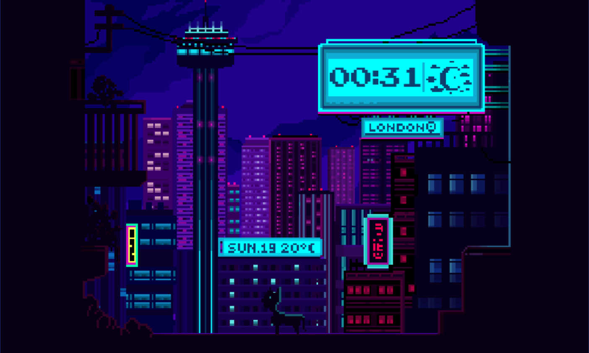

# Lofi-clock

  

This project is an entry for the [flutter clock challenge](https://flutter.dev/clock) hosted by Google for Lenovo Smart clock, 2020.
Our preferred testing enviornment was an Android emulator. The app works best on a 5:3 screen that has a resolution of 800x480 pixels in landscape mode.

We made a clock face that borrows influence from Lofi music videos. Unfortunately, due to unexpected power cut, our graphic designer is unable to finish animations in time. Not to worry, we plan on finishing the project post competition and judging.

We would REALLY encourage feedback on this project, whether you are the judge, or a fellow flutter developer. We basically jumped in with no prior flutter expereince, hence can use advice on how to properly refactor the app! :)
-
Code Contributors-

-[Michael Wilson](https://github.com/nosliwmichael),

-[Nishant Grover](https://github.com/nishantg95),

-[Oscar Serna](https://github.com/oserna1/)
